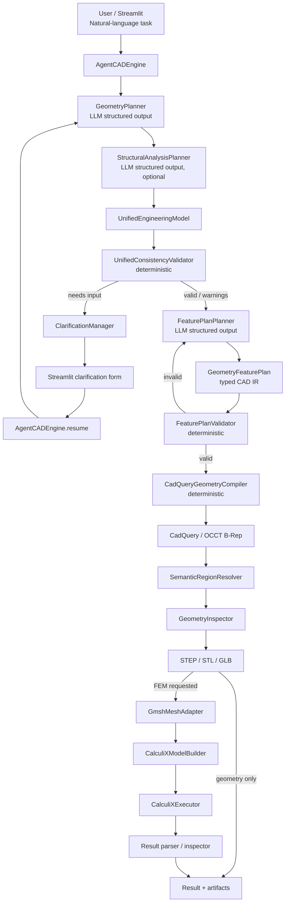
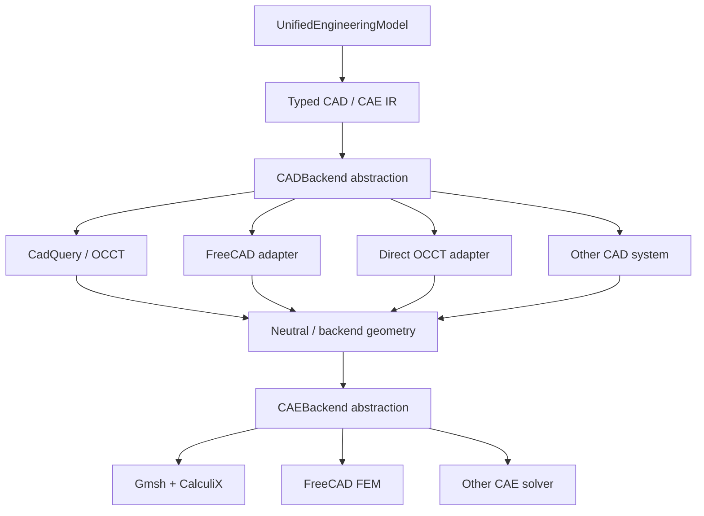

# AgentCAD v3

**AgentCAD v3** is a verifier-guided agentic CAD/CAE prototype that converts natural-language engineering intent into a typed engineering model and a typed CAD intermediate representation (CAD IR), then executes the CAD plan deterministically with **CadQuery/OCCT**. Structural analysis is implemented through an independent **STEP → Gmsh → CalculiX** pipeline.

Current version: **3.0.0-alpha.2**.

The main architectural principle is:

> **LLMs interpret engineering intent and create typed plans; deterministic components construct, validate, mesh, solve, and inspect engineering artifacts.**

This is the key difference from AgentCAD v2, where the LLM generated a relatively large FreeCAD/FEM Python script and the system had to validate and repair source code. In v3, the LLM no longer generates CadQuery source code. It produces a structured `GeometryFeaturePlan`, while the deterministic `CadQueryGeometryCompiler` performs the actual CAD construction.

---

## 1. Overall system workflow



The orchestration is implemented with **LangGraph**. `AgentCADEngine` is the public application-facing facade used by Streamlit, CLI, tests, and future APIs.

---

## 2. Three different loops in AgentCAD v3

AgentCAD v3 contains three conceptually different iterative mechanisms. Keeping them separate is important for both reliability and debugging.

### 2.1 Structured-output retry for `GeometryPlanner`

`GeometryPlanner` is an LLM-based structured-output planner. The retry loop is **not implemented in Streamlit**. It is implemented in the orchestration layer in:

```text
agentcad/engine/graph_builder.py
```

Specifically, `GraphBuilder._plan_geometry()` calls `GeometryPlanner.plan(...)` and retries when the LLM response cannot be validated as a typed `GeometrySpec`.

For example, the LLM may incorrectly return:

```text
overall_dimensions_mm = "400 x 400 x 100 mm"
```

instead of the required structured representation:

```json
{
  "x": 400.0,
  "y": 400.0,
  "z": 100.0
}
```

When this happens, the graph:

1. captures the Pydantic validation error;
2. writes a diagnostic JSON file and traceback;
3. passes failure feedback back to the planner;
4. retries the structured generation within a bounded retry budget.

The same pattern is used for `StructuralAnalysisPlanner`.

In the current alpha implementation, the automatic structured-output retry budget is derived from `max_planning_iterations` and capped at three attempts.

### 2.2 Engineering clarification loop

This loop is used when the planners return syntactically valid models, but the deterministic engineering validation identifies missing, conflicting, or insufficient information.

```text
GeometryPlanner
      ↓
StructuralAnalysisPlanner
      ↓
UnifiedConsistencyValidator
      ↓
needs_input
      ↓
ClarificationManager
      ↓
Streamlit asks the user
      ↓
AgentCADEngine.resume(thread_id, answers)
      ↓
planning starts again with accumulated clarification history
```

The responsibilities are deliberately separated:

```text
GraphBuilder
    decides whether clarification is required

AgentCADEngine
    owns the run context and resumes the workflow

Streamlit
    displays questions, collects answers and calls engine.resume(...)
```

`AgentCADEngine.resume()` preserves:

- the original task description;
- the same `thread_id`;
- the same output directory;
- previous clarification answers;
- the clarification round number;
- all previously created diagnostic artifacts.

Therefore, **the cyclic engineering workflow belongs to the engine/orchestration layer, not to Streamlit**. Streamlit is only the human-in-the-loop interface.

The sidebar control **Maximum clarification rounds** is currently mapped to `EngineSettings.max_planning_iterations`.

> Current implementation note: the same setting also influences the bounded structured-output retry budget. In a later refactoring these should be split into separate options such as `max_clarification_rounds` and `max_planner_output_attempts`.

### 2.3 CAD plan repair loop

After the engineering specification is valid, `FeaturePlanPlanner` creates a `GeometryFeaturePlan`. The plan is checked by `FeaturePlanValidator` and then executed by CadQuery.

If the CAD IR is invalid or CadQuery construction fails, AgentCAD can request another feature plan, up to:

```text
EngineSettings.max_feature_plan_attempts
```

This loop is independent of engineering clarification.

---

## 3. Core engineering representations

### 3.1 `GeometrySpec`

`GeometryPlanner` converts the natural-language request into a typed engineering description of geometry.

Location:

```text
agentcad/models/geometry.py
agentcad/planners/geometry_planner.py
```

This model describes engineering intent, dimensions, semantic regions, assumptions, and related geometry-level information. It does not contain CadQuery code.

### 3.2 `StructuralAnalysisSpec`

When structural analysis is enabled, `StructuralAnalysisPlanner` produces a typed CAE specification containing materials, boundary conditions, loads, mesh settings, and analysis parameters.

Location:

```text
agentcad/models/simulation.py
agentcad/models/material.py
agentcad/models/loads.py
agentcad/models/boundary_conditions.py
agentcad/models/mesh.py
agentcad/planners/structural_analysis_planner.py
```

### 3.3 `UnifiedEngineeringModel`

`UnifiedEngineeringModel` is the canonical CAD/CAE-independent engineering contract.

Location:

```text
agentcad/models/unified_specification.py
```

Conceptually:

```text
UnifiedEngineeringModel
├── original_request
├── task_intent
├── geometry
├── structural_analysis
├── clarifications
└── validation_report
```

The canonical engineering model should remain independent of CadQuery, FreeCAD, Gmsh, CalculiX, or any other specific CAD/CAE API.

### 3.4 `GeometryFeaturePlan`

`GeometryFeaturePlan` is the typed CAD intermediate representation between LLM reasoning and CAD execution.

Location:

```text
agentcad/models/feature_plan.py
```

It contains:

```text
GeometryFeaturePlan
├── version
├── units
├── root_feature
├── steps[]
├── semantic_regions[]
└── assumptions[]
```

Each `FeatureStep` defines an operation, its inputs/target, and parameters.

Current operations include:

- `box`;
- `cylinder`;
- `cone`;
- `sphere`;
- `extrude`;
- `revolve`;
- `hole`;
- `cut`;
- `fuse`;
- `intersect`;
- `fillet`;
- `chamfer`;
- `translate`;
- `rotate`;
- `mirror`;
- `linear_pattern`;
- `circular_pattern`.

---

## 4. CadQuery as the primary CAD backend

CadQuery is the **reference CAD backend** in AgentCAD v3.

The critical difference is that **CadQuery code is not generated by the LLM**.

The LLM creates:

```text
GeometryFeaturePlan
```

and the deterministic module:

```text
agentcad/geometry/compiler.py
```

with class:

```text
CadQueryGeometryCompiler
```

performs the actual construction.

The execution chain is:

```text
FeaturePlanPlanner
        ↓
GeometryFeaturePlan
        ↓
FeaturePlanValidator
        ↓
CadQueryGeometryCompiler
        ↓
CadQuery Workplane operations
        ↓
OCCT B-Rep
```

For example, a typed operation:

```text
operation = box
x = 400
y = 400
z = 100
```

is deterministically mapped inside `CadQueryGeometryCompiler._execute(...)` to the corresponding CadQuery operation.

This separation gives AgentCAD several advantages.

### Deterministic CAD execution

The same valid CAD IR should produce the same sequence of CadQuery operations without another LLM decision inside the compiler.

### Direct OCCT B-Rep access

AgentCAD can inspect the real CAD topology before STL tessellation. The geometry layer can therefore validate properties such as:

- shape validity;
- number of solids;
- bounding dimensions;
- volume;
- surface area;
- geometric faces and edges;
- semantic regions.

### Easier testing

The deterministic CAD layer can be tested independently of any LLM:

```text
GeometryFeaturePlan
      ↓
FeaturePlanValidator
      ↓
CadQueryGeometryCompiler
      ↓
GeometryInspector
```

This makes regression testing much easier than testing arbitrary generated Python macros.

### Headless execution

CadQuery can run as a Python library without starting a desktop CAD application, making it suitable for Linux servers, Streamlit deployments, containers, and future distributed CAD/CAE workers.

### Neutral export

The current geometry exporter supports:

```text
OCCT B-Rep
├── STEP
├── STL
└── GLB
```

STEP is the main neutral CAD exchange format and is also used for the direct Gmsh FEM path. STL is used for tessellated viewing/3D printing, while GLB is suitable for web-oriented visualization.

---

## 5. Semantic regions

AgentCAD avoids using unstable identifiers such as:

```text
Face7
Face12
Edge5
```

Boundary conditions and loads should instead reference semantic engineering regions such as:

```text
top_surface
bottom_surface
fixed_end
pressure_surface
hole_surfaces
bearing_surface
```

Semantic rules are stored in the CAD IR and resolved on the final B-Rep.

Relevant modules:

```text
agentcad/models/feature_plan.py
agentcad/geometry/region_resolver.py
```

Current selector concepts include:

- CadQuery selectors;
- extreme faces along X/Y/Z;
- surface type;
- source feature;
- expected entity count.

The same semantic regions can later be transferred to Gmsh physical groups and then used in solver boundary conditions and loads.

---

## 6. Geometry validation and export

After CadQuery construction, the geometry is inspected by:

```text
agentcad/geometry/inspector.py
```

and exported by:

```text
agentcad/geometry/exporter.py
```

The intended CAD verification chain is:

```text
GeometryFeaturePlan
      ↓
FeaturePlanValidator
      ↓
CadQueryGeometryCompiler
      ↓
SemanticRegionResolver
      ↓
GeometryInspector
      ↓
STEP / STL / GLB
```

STL is not considered the canonical geometry representation. The primary geometry is the OCCT B-Rep produced through CadQuery.

---

## 7. FEM pipeline

FreeCAD is no longer required in the mandatory FEM execution path.

The current v3 architecture is:

```text
CadQuery / OCCT
      ↓
STEP
      ↓
GmshMeshAdapter
      ↓
mesh + physical groups
      ↓
CalculiXModelBuilder
      ↓
CalculiX .inp
      ↓
CalculiXExecutor
      ↓
FRD / DAT
      ↓
Result parser / inspector
```

Relevant modules:

```text
agentcad/meshing/gmsh_adapter.py
agentcad/solvers/calculix/model_builder.py
agentcad/solvers/calculix/executor.py
agentcad/solvers/calculix/result_parser.py
agentcad/solvers/calculix/result_inspector.py
```

The current CAE scope is intentionally narrower than the geometry layer and is focused on the initial direct Gmsh + CalculiX integration.

---

## 8. Future CAD/CAE backend abstraction

CadQuery is intentionally treated as the **current reference backend**, not as the permanent canonical representation of AgentCAD.

The long-term architecture should introduce explicit backend interfaces:



A future CAD backend interface could conceptually provide:

```text
CADBackend
├── capabilities()
├── build(feature_plan)
├── resolve_regions(...)
├── inspect(...)
└── export(...)
```

A future CAE backend interface could provide:

```text
CAEBackend
├── capabilities()
├── create_mesh(...)
├── build_analysis_model(...)
├── solve(...)
└── parse_results(...)
```

Potential CAD implementations may include:

- CadQuery / OCCT;
- FreeCAD;
- direct OCCT;
- other open-source CAD frameworks;
- commercial CAD products with suitable automation APIs.

Potential CAE implementations may include:

- Gmsh + CalculiX;
- FreeCAD FEM;
- other open-source solvers;
- commercial CAE systems through supported APIs or neutral exchange formats.

The intended architectural rule is:

> **Neither the natural-language planners nor the canonical engineering model should depend on one concrete CAD/CAE product.**

This creates a path toward capability-based backend selection, where AgentCAD could choose a backend according to the requested geometry, analysis type, solver capabilities, licensing constraints, or deployment environment.

---

## 9. AgentCADEngine and LangGraph

The central application facade is:

```text
agentcad/engine/agentcad_engine.py
```

`AgentCADEngine` owns the main runtime services:

- planners;
- deterministic validators;
- CadQuery compiler;
- geometry inspector/exporter;
- Gmsh adapter;
- CalculiX components;
- artifact store;
- failure classifier;
- run/thread context.

LangGraph orchestration is implemented in:

```text
agentcad/engine/graph_builder.py
```

The current high-level graph is conceptually:

```text
START
  ↓
plan_geometry
  ↓
plan_analysis
  ↓
validate_engineering_model
  │
  ├── needs input
  │      ↓
  │  prepare_clarification
  │      ↓
  │     END
  │      ↓ external HIL boundary
  │  engine.resume(...)
  │      ↓
  │     START
  │
  └── valid
         ↓
     plan_features
         ↓
     validate_feature_plan
         │
         ├── repair → plan_features
         │
         └── valid
                ↓
           build_geometry
                │
                ├── repair → plan_features
                ├── geometry only → END
                └── FEM → Gmsh/CalculiX → END
```

The user clarification boundary intentionally ends the current graph execution. The next user response is passed through `AgentCADEngine.resume(...)`, which rebuilds the planning state with the accumulated clarification history.

---

## 10. Streamlit application

The current Streamlit interface is fully in English and is designed not only as a launcher but also as a development and debugging interface.

Location:

```text
app/streamlit_agentcad.py
```

The application provides:

- natural-language task input;
- optional structural-analysis mode;
- LLM provider/model settings;
- temperature control;
- maximum clarification rounds;
- maximum CAD plan attempts;
- Gmsh executable setting;
- CalculiX executable and timeout;
- output directory configuration;
- API-key status;
- iterative engineering clarification forms;
- pipeline protocol;
- structured engineering model inspection;
- CAD validation information;
- interactive STL visualization;
- FEM information;
- diagnostics;
- complete run-file browser.

### Result tabs

The current result interface contains:

```text
Pipeline
Engineering Model
CAD / Validation
3D STL
FEM
Diagnostics
Files
```

### Pipeline

Shows the current status, clarification round, CAD plan attempts, diagnostic count, and ordered execution events.

### Engineering Model

Shows structured planner outputs and the unified engineering model.

### CAD / Validation

Shows the `GeometryFeaturePlan`, deterministic validation, and geometry inspection results.

### 3D STL

Generated STL files can be viewed interactively directly in Streamlit using Plotly. The viewer supports rotation, zoom and pan and also reports the triangle count and X/Y/Z dimensions.

### FEM

Shows FEM-related specifications, execution state and available result summaries.

### Diagnostics

Shows structured failures, Pydantic validation errors, planner retry information, orchestration exceptions, CadQuery/Gmsh/CalculiX errors, and tracebacks where available.

### Files

Shows files from the complete run workspace even when the run fails. This preserves the debugging transparency that was useful in AgentCAD v2.

---

## 11. Persistent run artifacts and diagnostics

Each request receives its own directory under:

```text
AGENTCAD_OUTPUT_ROOT
```

The run directory is preserved after success, failure, planner retries, and clarification rounds.

A typical structure is:

```text
<run>/
├── request.txt
├── run_result.json
│
├── specification/
│   ├── geometry_spec.json
│   ├── geometry_spec_round_00.json
│   ├── geometry_spec_round_01.json
│   ├── structural_analysis.json
│   ├── engineering_model.json
│   ├── engineering_model_round_00.json
│   ├── feature_plan.json
│   └── feature_plan_attempt_01.json
│
├── validation/
│   ├── clarification_history.json
│   ├── clarification_history_round_00.json
│   ├── clarification_questions.json
│   ├── clarification_questions_round_00.json
│   ├── engineering_validation.json
│   ├── engineering_validation_round_00.json
│   ├── feature_plan_validation.json
│   └── geometry_inspection.json
│
├── logs/
│   ├── events.json
│   ├── final_state.json
│   ├── run_result_round_00.json
│   ├── geometry_planner_attempt_01_error.json
│   ├── geometry_planner_attempt_01_traceback.txt
│   ├── feature_plan_planner_attempt_01_error.json
│   ├── feature_plan_planner_attempt_01_traceback.txt
│   ├── failure.json
│   └── orchestration_traceback.txt
│
├── geometry/
│   ├── model.step
│   ├── model.stl
│   └── model.glb
│
├── mesh/
├── solver/
└── results/
```

Not every file exists in every run. Files are written when the corresponding stage is reached.

This logging strategy is intentional: **a failed run is still an engineering experiment and should retain enough intermediate state to identify why it failed.**

---

## 12. Repository structure

```text
AgentCAD_v3/
├── agentcad/
│   ├── config/
│   │   └── settings.py
│   ├── engine/
│   │   ├── agentcad_engine.py
│   │   ├── graph_builder.py
│   │   ├── state.py
│   │   └── result.py
│   ├── planners/
│   │   ├── geometry_planner.py
│   │   ├── structural_analysis_planner.py
│   │   ├── feature_plan_planner.py
│   │   ├── clarification_manager.py
│   │   └── parameter_explainer.py
│   ├── models/
│   │   ├── geometry.py
│   │   ├── feature_plan.py
│   │   ├── unified_specification.py
│   │   ├── material.py
│   │   ├── loads.py
│   │   ├── boundary_conditions.py
│   │   ├── mesh.py
│   │   ├── simulation.py
│   │   └── validation.py
│   ├── validators/
│   │   ├── unified_consistency_validator.py
│   │   ├── feature_plan_validator.py
│   │   ├── geometry_validator.py
│   │   ├── material_validator.py
│   │   ├── load_validator.py
│   │   ├── boundary_condition_validator.py
│   │   ├── mesh_validator.py
│   │   └── units.py
│   ├── geometry/
│   │   ├── compiler.py
│   │   ├── region_resolver.py
│   │   ├── inspector.py
│   │   └── exporter.py
│   ├── meshing/
│   │   └── gmsh_adapter.py
│   ├── solvers/
│   │   └── calculix/
│   │       ├── model_builder.py
│   │       ├── executor.py
│   │       ├── result_parser.py
│   │       └── result_inspector.py
│   ├── inspectors/
│   │   └── failure_classifier.py
│   ├── storage/
│   │   └── artifact_store.py
│   ├── llm/
│   │   ├── model_factory.py
│   │   ├── prompt_loader.py
│   │   └── prompts/
│   └── cli.py
├── app/
│   └── streamlit_agentcad.py
├── examples/
├── tests/
├── schemas/
├── docs/
├── environment.yml
├── pyproject.toml
└── .env.example
```

---

## 13. Installation

Conda/Mamba is recommended because CadQuery/OCCT, Gmsh, and CalculiX contain native dependencies.

```bash
conda env create -f environment.yml
conda activate agentcad-v3
pip install -e .
```

Create the local configuration file:

```bash
cp .env.example .env
```

Then configure either:

```text
OPENROUTER_API_KEY
```

or:

```text
OPENAI_API_KEY
```

The current Python package dependencies include:

- CadQuery 2.8+;
- Pydantic 2.12+;
- LangChain Core;
- LangGraph;
- OpenAI/OpenRouter integrations;
- Gmsh;
- Streamlit;
- Plotly.

The Conda environment also installs CalculiX.

---

## 14. Running the Streamlit application

```bash
conda activate agentcad-v3
cd /path/to/AgentCAD_v3
streamlit run app/streamlit_agentcad.py
```

The default local address is normally:

```text
http://localhost:8501
```

---

## 15. CLI usage

Geometry-only request:

```bash
agentcad "Create a rectangular plate 80 x 40 x 3 mm with four 5 mm through holes"
```

Geometry plus FEM:

```bash
agentcad --fem "Create a steel plate, fix the outer boundary and apply pressure to the top surface"
```

---

## 16. Deterministic use without an LLM

The CAD execution layer can be used independently of the LLM by supplying an already valid `GeometryFeaturePlan`.

```text
GeometryFeaturePlan
      ↓
FeaturePlanValidator
      ↓
CadQueryGeometryCompiler
      ↓
GeometryInspector
      ↓
STEP / STL / GLB
```

This is useful for:

- unit tests;
- regression benchmarks;
- programmatic geometry generation;
- future alternative planning algorithms;
- future optimization loops;
- future non-LLM integrations.

---

## 17. Current limitations

AgentCAD v3 is still an alpha research prototype.

Important current limitations include:

- the in-memory `thread_id` clarification context is lost if the Streamlit process is restarted;
- planner retry and clarification settings are not yet fully separated;
- the CAD operation set is intentionally bounded by the typed `FeatureOperation` enum;
- assembly modeling is not yet part of the stable workflow;
- semantic-region handling is still being expanded;
- FEM support is narrower than geometry support;
- full FRD numerical field analysis is not yet complete;
- shell, beam, nonlinear, contact, thermal, and thermomechanical workflows require further development;
- explicit generic `CADBackend` / `CAEBackend` interfaces are a planned architectural extension rather than a completed abstraction in the current alpha.

---

## 18. Design direction

AgentCAD v3 should not be understood as simply:

```text
LLM → CadQuery
```

The intended architecture is:

```text
Natural-language engineering intent
              ↓
    UnifiedEngineeringModel
              ↓
       typed CAD / CAE IR
              ↓
 deterministic verification
              ↓
    capability-based adapters
        /               \
   CAD backend        CAE backend
```

CadQuery/OCCT and Gmsh/CalculiX are the current open-source reference implementations for this architecture.

The long-term goal is to make AgentCAD a **backend-independent engineering orchestration layer** that can connect natural-language engineering reasoning, deterministic CAD construction, numerical analysis, validation, human clarification, and reproducible diagnostics while remaining independent of any single CAD or CAE product.

---

## 19. Additional documentation

- [Architecture](docs/ARCHITECTURE.md)
- [CAD IR](docs/CAD_IR.md)
- [FEM backend](docs/FEM_BACKEND.md)
- [Migration from AgentCAD v2](docs/MIGRATION_FROM_V2.md)
- [Roadmap](docs/ROADMAP.md)
